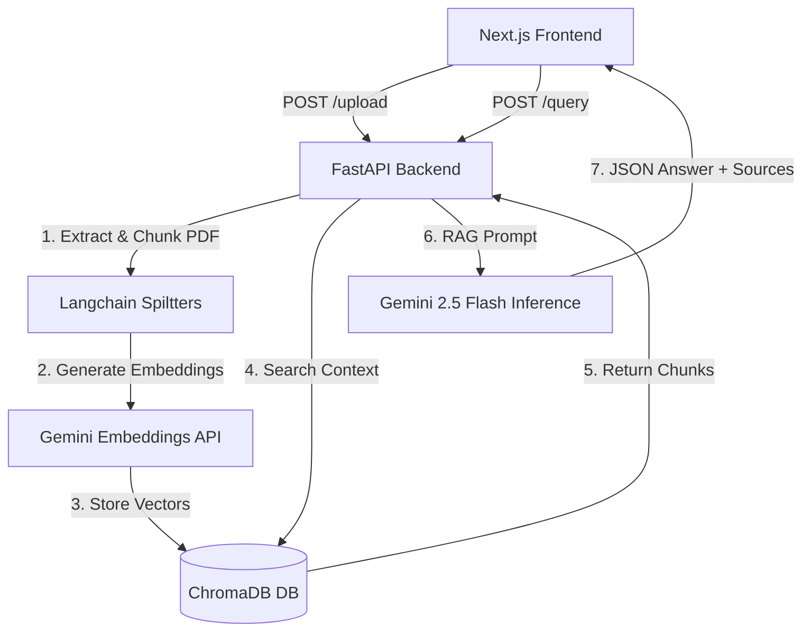

# ⚖️ JurisAI: Premium Legal Document Intelligence 
> A robust, Retrieval-Augmented Generation (RAG) platform that transforms dense legal PDFs into instantly accessible, highly actionable knowledge using Google Gemini 2.5 and semantic vector search.

**[Live Backend API]** | **[Live Client UI]** (Update with your live Vercel/Render URLs!)

---

## 📖 Executive Summary (Non-Technical)

Legal professionals spend countless hours manually parsing through hundreds of pages of case law, contracts, and precedents to find specific clauses or precedents. **JurisAI** solves this bottleneck.

It is a full-stack AI web application where a user can upload a legal document (like a trial transcript, a corporate contract, or a statute) and ask it complex questions in plain English. The AI doesn't just "guess" the answer; it searches the document mathematically, extracts the exact relevant clauses, translates the legalese into plain English, and provides the answer alongside **verified source citations**, effectively eliminating AI hallucinations.

**Key Features:**
- **Instant Answers:** Ask "Who won this case?" or "What is the penalty for early termination?", and get answers in seconds.
- **Source Citations:** Every AI answer provides the exact snippet and relevance score from the source document so you can double-check the facts.
- **Quick Analysis:** One-click shortcuts to automatically rip through the document and summarize critical topics like "Termination Clauses", "Confidentiality", and "Governing Law".
- **Secure File Handling:** Files are isolated entirely inside the vector database for your current session.

---

## 🛠 Project Architecture (Technical)

JurisAI has been architected as a modern, decoupled cloud application. It utilizes a lightning-fast React frontend and a heavy-lifting Python API backend.

### The Stack:
* **Frontend:** Next.js 14, React, TypeScript, Tailwind CSS, Lucide Icons.
* **Backend:** Python 3.10+, FastAPI, Uvicorn.
* **AI & Machine Learning:** Google Generative AI (`gemini-2.5-flash` model, Gemini Embeddings), ChromaDB.
* **Document Processing:** Langchain `RecursiveCharacterTextSplitter`, PyPDF2.



### 1. Document Ingestion Pipeline (`/upload`)
When a user uploads a PDF, the backend routes the file into memory and extracts the raw text. Because LLMs have context limits and processing an entire book every query is expensive, the text is pushed through a **Langchain Recursive Splitter**. This breaks the legal document into 1000-character chunks while respecting paragraph and sentence boundaries. 

### 2. Semantic Embedding & Vector Storage
Each text chunk is handed off to **Google Gemini**. Gemini translates the human language into a massive array of numbers (a "semantic vector"). These vectors map the *meaning* of the chunk onto a multi-dimensional graph. These vectors are then stored persistently in a local **ChromaDB** vector database.

### 3. Retrieval-Augmented Generation (RAG) (`/query`)
When a user asks a question, we first embed the question using Gemini into a vector array. We ping ChromaDB to search for the *mathematically closest* clusters of text chunks to our question vector. We take the top 5 most relevant document chunks and inject them into a massive System Prompt alongside the user's question.

The system prompt strictly commands the **Gemini 2.5 Flash** model to *only* answer using the injected chunks, and to explicitly cite them, eliminating any outside "hallucinations".

---

## 🚀 Running Locally

### 1. Run the FastAPI Backend
```bash
cd backend
python -m venv .venv
source .venv/scripts/activate  # On Windows

# Install the dependencies (CPU-optimized for massive performance gains)
pip install -r requirements.txt

# Create a .env file and add your Google API key
echo "GEMINI_API_KEY=your_key_here" > .env

# Start the local server
uvicorn main:app --host 0.0.0.0 --port 8000
```

### 2. Run the Next.js Frontend
```bash
cd frontend

# Install Node dependencies
npm install

# Start the Next.js development server
npm run dev
```
Navigate to `http://localhost:3000` to interact with the application.

---

## ☁️ Deployment Guides

### Deploying the Backend to Render (Free Tier)
1. Fork/Clone this repository and connect it to a new [Render Web Service](https://render.com).
2. Set the Root Directory to `backend`.
3. Set the Build Command: `pip install -r requirements.txt` (This will specifically pull the CPU-only versions of massive ML libraries to bypass Render's strict 512MB RAM limit).
4. Set the Start Command: `uvicorn main:app --host 0.0.0.0 --port $PORT`
5. Add `GEMINI_API_KEY` under the Environment section.

### Deploying the Frontend to Vercel
1. Log into [Vercel](https://vercel.com) and import the repository.
2. Select Next.js and change the Root Directory configuration to `frontend`.
3. Under Environment Variables, add `NEXT_PUBLIC_BACKEND_URL` and set its value to your live Render API URL (e.g. `https://jurisai-backend.onrender.com`).
4. Click Deploy.

---

*Made with ❤️ by [Goutam Chandnani](https://www.linkedin.com/in/goutamchandnani/)*
